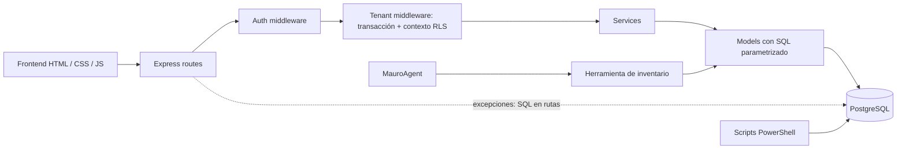

# Auditoría de arquitectura actual — AMC Facturación Electrónica y POS

**Corte:** 25 de septiembre de 2026  
**Tipo:** inspección estática del repositorio; no se consultó una base de datos ni un entorno desplegado.

## Resumen

El repositorio ya tiene un backend Node.js/Express, PostgreSQL, migraciones numeradas, middleware de autenticación y tenant, servicios de dominio, modelos con SQL, auditoría, un backup lógico completo y una herramienta acotada para Mauro. No parte de cero.

La separación es parcial: las rutas de Express también cumplen el papel de controladores, hay SQL en dos archivos de rutas y en dos servicios, y los modelos mezclan acceso a datos y operaciones de persistencia. No existen directorios `controllers/`, `repositories/`, `providers/` ni `tests/` en el backend observado. La interfaz está compuesta por páginas HTML/CSS/JavaScript sin manifiesto npm propio.

La prioridad previa a mover carpetas es validar la autenticación con el rol PostgreSQL de aplicación: la configuración predeterminada usa `amc_app`, pero la consulta de usuario y sesión ocurre antes de establecer el contexto del tenant, mientras esas tablas usan RLS forzado.

## Inventario de alto nivel

| Área | Estado observado |
| --- | --- |
| Frontend | 32 páginas HTML, JavaScript y CSS organizados por módulos funcionales. |
| Backend | Express 4 / Node.js 18+, con 13 routers, 9 servicios, 9 modelos, 4 middlewares, 2 utilidades, 1 agente y 1 herramienta de IA. |
| Base de datos | 9 migraciones SQL versionadas; 15 entidades lógicas declaradas, más 32 particiones de facturas y cotizaciones. |
| Seguridad multiempresa | JWT, middleware tenant, transacción por petición y RLS para las entidades operativas con `empresa_id`. |
| Integración DIAN/XML | CUFE está marcado como demostrativo; CUDE se calcula con una cadena local. No se encontró generación/firma UBL ni proveedor DIAN. |
| Backups | Script PowerShell de `pg_dump` completo, manifiesto SHA-256, verificación y simulacro de restauración. |
| Pruebas | El script npm declara `node --test tests/`, pero no existe `backend/tests/`. |

## Flujo actual



## Estructura existente

```text
frontend/                 Páginas y módulos de interfaz
  components/chatbot/     Mauro IA de interfaz
  js/                     Aplicación, auth, cliente API y datos locales
  compras/ cotizaciones/ facturas-generadas/
  inventarios/ nomina-electronica/ productos/ reportes/
  terceros/ usuario/ pos/ calendario/
backend/
  ai/                     MauroAgent y tools
  db/                     pool, migraciones y runner
  middleware/             auth, tenant, validación y errores
  models/                 entidades y consultas PostgreSQL
  routes/                 endpoints y handlers Express
  scripts/                migración de datos, auditoría, seeds y backups
  services/               servicios de dominio existentes
  utils/                  errores y criptografía
assets/                   recursos compartidos
docs/                     respaldo y recuperación
```

## Hallazgos de diseño

- `routes/` contiene middleware, validación, orquestación HTTP y respuestas; actúa como Controller, aunque no se llame así.
- `models/` es la capa que concentra la mayor parte del SQL, pero no expone una convención uniforme de Repository.
- Se detectó SQL directo en `backend/routes/auditoria.routes.js` y `backend/routes/usuarios.routes.js`; también en `backend/services/UsuarioService.js` y `backend/services/EmpresaService.js`.
- Hay validadores reutilizables (`middleware/validate.js`), pero no todos los módulos los aplican.
- El middleware tenant mantiene una transacción abierta hasta terminar la respuesta y establece el contexto RLS en la conexión asignada.
- El backend inicia únicamente la API; `server.js` no sirve los archivos del frontend.
- Las rutas relativas del frontend y la apertura directa con `file:///` son dependencias importantes; mover páginas requiere actualizar y probar enlaces y scripts.

## Secuencia recomendada

1. Cerrar esta auditoría estática y establecer pruebas de humo reproducibles.
2. Resolver/validar acceso de login y revocación JWT bajo RLS usando el rol real de aplicación.
3. Extraer un módulo piloto a Controller → Service → Repository sin cambiar URL, contrato JSON ni esquema.
4. Repetir por módulo, con pruebas de regresión, antes de mover archivos de frontend.
5. Tratar DIAN/XML, backups por tenant y proveedores de IA como proyectos separados con requisitos, seguridad y pruebas propios.

La propuesta de manual CTO extenso queda como documentación futura por entregas; este corte no inventaría funcionalidades ni certificaciones que el código aún no implementa.
